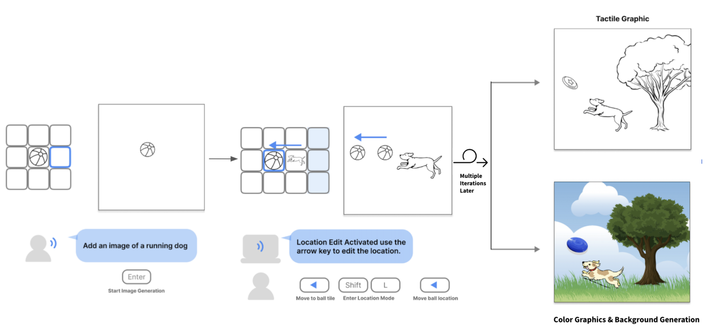

# AltCanvas

AltCanvas : Speech2AI based Image Editor
Our system, AltCanvas, features a tile-based interface enabling users to construct visual scenes incrementally, with each tile representing an object within the scene. Users can add, edit, move, and arrange objects while receiving speech and audio feedback. Once completed, the scene can be rendered as a color illustration or as a vector for tactile graphic generation.
You can read the paper for this code here `https://arxiv.org/abs/2408.10240` (ASSETS 2024)



### API Keys 
A total of two API keys are required to run this.
The OpenAI API key and the Background Removal API key. 
If we are directly working with you on a project and you would like access please contact `shlee@cs.stanford.edu`.

Otherwise, you will have to provide the API keys on your own through 
OpenAI: https://platform.openai.com/docs/overview 
Background Removal: https://www.remove.bg/api 


### Localhost Testing 

```
npm run build 
serve -s build
```

Recommened test through `http://localhost:3000`
CORS policies allowed for localhost testing is added in cors.json 


```
//cors.json 
[
  {
    "origin": ["http://localhost:3000", "http://0.0.0.0:3001"],
    "method": ["GET"],
    "responseHeader": ["Content-Type"],
    "maxAgeSeconds": 3600
  }
]
```

To configure them into Google Cloud Storage
```
gsutil cors set cors.json gs://altcanvas-storage
```
