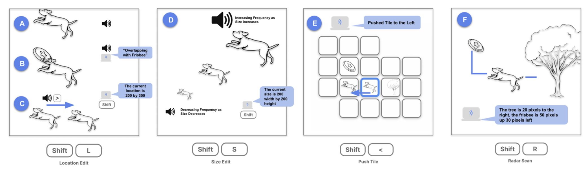

# AltCanvas: an Accessible Image Editor powered by Image Generation Models

---

## Overview

**AltCanvas** is an accessible, image editor powered by Image Generation Models specifically designed for Blind and Low-Vision users. Using a combination of text-to-image models and a tile-based interface, AltCanvas empowers users to create and modify visual scenes through text descriptions and keyboard interactions. The application incorporates audio feedback and spatial cues to guide users, making it easy to understand visual layouts and image positions without sight.

---




---
# Coming Soon!

## Fine-Tuning the Model for Specific Image Generation Tasks
AltCanvas aims to expand its capabilities by enabling model fine-tuning based on specific BVI user data. In future versions, we will explore:

- **Custom Dataset Integration**: Using data from specific user interactions to improve model performance.
- **Task-Specific Training**: Fine-tuning models to generate more accessible visual outputs with minimal detail, optimized for tactile and coloring book styles.
- **Model Hosting Options**: Moving models to a custom endpoint for enhanced control and faster inference times.

### How to Fine-Tune Models
We will include a guide for setting up and running model fine-tuning. This will cover preparing datasets, running training scripts, and testing model output for BVI-focused use cases.


---

### Model Endpoint
The AltCanvas application integrates AI models from OpenAI's API to perform image generation and description tasks, using the `gpt-4o` model as the primary endpoint. This endpoint supports both text-based and image-based tasks, helping users generate simple line-art images based on prompts, which are designed for accessibility. 

> **File Location:** Please refer to `src/components/SonicTiles.jsx` for the main implementation of the model endpoint.

#### Endpoint Setup
In the code, the endpoint is configured within the `generateImage` and other related functions. To change or experiment with different models, locate the `createImage` and `createChatCompletion` calls within these functions. Here’s an example of the endpoint call setup:

```javascript
const response = await openai.createImage({
  prompt: `You are a children's COLORING BOOK GRAPHIC DESIGNER...`,
  n: 1,
});
```


#### Experimenting with other models

Hugging Face offers a variety of models that can be integrated into AltCanvas for experimentation, including popular models like Stable Diffusion, which provides flexibility in generating images based on text prompts. To explore available models, visit the [Hugging Face Model Hub](https://huggingface.co/models). You can search for models such as Stable Diffusion and review their documentation for specific integration details.

#### Sample Code

```
import { DiffusionPipeline } from 'diffusers';
const pipe = await DiffusionPipeline.from_pretrained('CompVis/stable-diffusion-v1-4');
const prompt = 'A simple outline of a cat, thick lines, no shading';
const image = await pipe(prompt);
```

---
## Interaction Elements and Sonification (Coming Soon)

### Interaction Guide
AltCanvas features a robust set of interactions, allowing users to navigate tiles and control object placement with keyboard commands. Future documentation will include:

- **Detailed Command Descriptions**: Breakdown of each command, including keyboard shortcuts and intended actions.
- **Navigation and Positioning**: Explanation of tile-based spatial navigation and radar scan functionality.

### Sonification Code
Sonification plays a crucial role in helping users understand object positioning. Our sonification system includes spatial sound cues to provide audio feedback based on relative object location. Future topics will include:

- **Sound Synthesis and Positioning**: Overview of how sound positioning is achieved using Web Audio API and `Tone.js`.
- **Customizable Audio Feedback**: Guide to modifying sound parameters, such as pitch, volume, and 3D panning, to improve user experience.

---
# Future Documentation

## Fine-Tuning the Model (Coming Soon)
AltCanvas aims to expand its capabilities by enabling model fine-tuning based on specific BVI user data. In future versions, we will explore:

- **Custom Dataset Integration**: Using data from specific user interactions to improve model performance.
- **Task-Specific Training**: Fine-tuning models to generate more accessible visual outputs with minimal detail, optimized for tactile and coloring book styles.
- **Model Hosting Options**: Moving models to a custom endpoint for enhanced control and faster inference times.

### How to Fine-Tune Models
We will include a guide for setting up and running model fine-tuning. This will cover preparing datasets, running training scripts, and testing model output for BVI-focused use cases.

---
## Key Features

- **Tile-Based Interface**: Users build visual scenes by adding, moving, editing, and arranging objects, each represented as a tile.
  
- **Generative AI Integration**: AI generates graphics based on user prompts, producing simple, thick-outlined images for easy tactile rendering and interpretation.

- **Keyboard-Controlled Accessibility**: Users can navigate tiles, adjust sizes, move items, and more, using intuitive keyboard commands. Each command triggers clear audio feedback.

- **Real-Time Audio Feedback**: Actions like moving or resizing images produce sound cues, enhancing spatial understanding of the canvas.

- **Spatial Awareness and Radar Scan**: The radar scan feature provides positional feedback for nearby objects, assisting users in comprehending layout and planning edits.

- **Tactile Graphics Support**: Rendered images can be saved with clear outlines and backgrounds, optimized for tactile graphic generation. 

---
## Citation

Please cite AltCanvas as follows:

```
@misc{lee2024altcanvastilebasedimageeditor,
  title={AltCanvas: A Tile-Based Image Editor with Generative AI for Blind or Visually Impaired People},
  author={Seonghee Lee and Maho Kohga and Steve Landau and Sile O'Modhrain and Hari Subramonyam},
  year={2024},
  eprint={2408.10240},
  archivePrefix={arXiv},
  primaryClass={cs.HC},
  url={https://arxiv.org/abs/2408.10240}
}
```