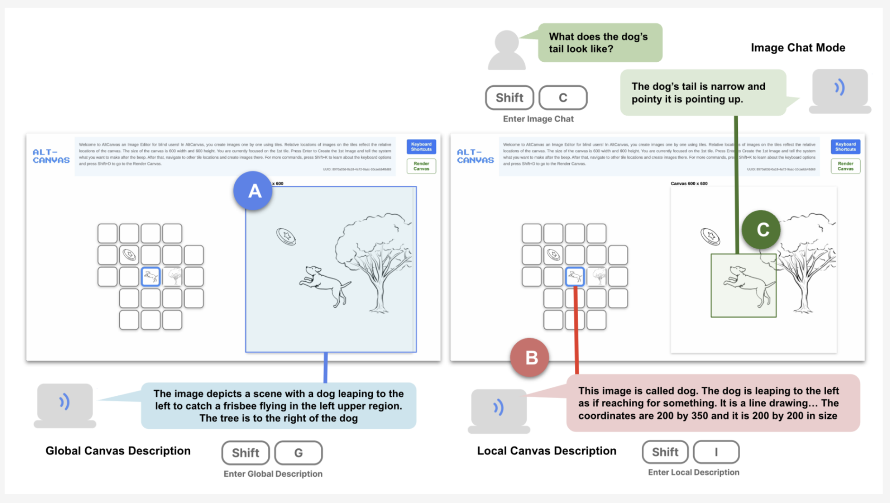

# AltCanvas: A Tile-Based Image Editor with Generative AI for Blind or Visually Impaired People

---

## Overview

**AltCanvas** is an accessible image editor specifically designed for blind or visually impaired (BVI) users. It enables users to create and modify visual scenes using a tile-based interface with keyboard-based interaction. Built with speech and auditory feedback, it helps users navigate, edit, and understand the visual layout through detailed audio descriptions and spatial cues, allowing for intuitive creation without visual references.

---




## Key Features

- **Tile-Based Interface**: Users build visual scenes by adding, moving, editing, and arranging objects, each represented as a tile.
  
- **Generative AI Integration**: AI generates graphics based on user prompts, producing simple, thick-outlined images for easy tactile rendering and interpretation.

- **Keyboard-Controlled Accessibility**: Users can navigate tiles, adjust sizes, move items, and more, using intuitive keyboard commands. Each command triggers clear audio feedback.

- **Real-Time Audio Feedback**: Actions like moving or resizing images produce sound cues, enhancing spatial understanding of the canvas.

- **Spatial Awareness and Radar Scan**: The radar scan feature provides positional feedback for nearby objects, assisting users in comprehending layout and planning edits.

- **Tactile Graphics Support**: Rendered images can be saved with clear outlines and backgrounds, optimized for tactile graphic generation.


---

## Image Gallery

Include sample images here for a visual reference of the generated output, highlighting AltCanvas’s ability to produce simple, tactile-friendly graphics with thick outlines and minimal details.

---

## Citation

Please cite AltCanvas as follows:

```bibtex
@misc{lee2024altcanvastilebasedimageeditor,
  title={AltCanvas: A Tile-Based Image Editor with Generative AI for Blind or Visually Impaired People},
  author={Seonghee Lee and Maho Kohga and Steve Landau and Sile O'Modhrain and Hari Subramonyam},
  year={2024},
  eprint={2408.10240},
  archivePrefix={arXiv},
  primaryClass={cs.HC},
  url={https://arxiv.org/abs/2408.10240}
}
